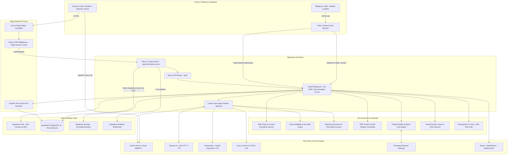

# COMPLETE SYSTEM ARCHITECTURE MAP — TRINETRA AI (VAAKRITI)

> **Document Status**: AUTHORITATIVE BASELINE  
> **Source of Truth**: MASTER_PLAN.md (v1.2, Section 18 Overrides)  
> **Rule**: Preserve existing communication pathways, network proxies, and service contracts.

---

## 1. End-to-End Architectural Flow Diagram



---

## 2. Detailed Primary Operational Workflows

### 2.1 Workflow A: Inbound Phone Call to AI Receptionist

```
Caller Dials Virtual Number (+91-XXXXX / +1-XXXXX)
   │
   ▼
Carrier (Exotel / Twilio) receives call and sends webhook to FastAPI:
   - Twilio: POST /webhooks/voice/twilio/{org_id} (or /twiml/inbound)
   - Exotel: POST /webhooks/voice/exotel/{org_id}
   │
   ▼
FastAPI resolves Assigned Agent from `phone_numbers` table:
   - Check carrier virtual number status (ACTIVE, GRACE, HOLD, EXPIRED)
   - If EXPIRED or in HOLD: Plays neutral unavailable audio ("The party you dialed is currently unavailable")
   - Enforce Concurrency Guard: Max 10 active concurrent calls per organization
   │
   ▼
Caller Lookup & Greeting Personalization (`CallerLookupService`):
   - Fast phone lookup in `customer_contacts`
   - If known caller: Retrieves previous call count, name, and past inquiry notes
   │
   ▼
Carrier Connects Audio Stream WebSocket to FastAPI:
   - Exotel: wss://api.trinetraedu-ai.com/webhooks/voice/exotel/stream/{room_name}
   - Twilio: wss://api.trinetraedu-ai.com/webhooks/voice/twilio/stream/{room_name}
   │
   ▼
LiveKit Room Provisioned & Agent Joins (`VikramAgent` in `backend/agent.py`):
   - Mandatory AI Identity Disclosure plays immediately:
     "Namaste [Name] ji! Main Trinetra se Arika hoon, ek AI sahayak..."
   - Mandatory Recording Consent checked:
     If caller objects, recording URL remains null and consent opt-out is recorded
   │
   ▼
Real-Time Turn-by-Turn Voice Pipeline:
   - User Speech -> Silero VAD -> Sarvam STT / Deepgram STT
   - Text -> IntentClassifier (Support vs Consultative Sales) -> PromptGuard
   - LLM Generation (Groq LLaMA 3.3 / Gemini 2.0 Flash)
   - Expressive Speech Synthesis (Sarvam Bulbul SSML / ElevenLabs) -> WebRTC Audio Out
   - Anti-Stall Guard (`ToolExecutionGuard`): If appointment tool > 700ms, plays natural filler
   │
   ▼
Call Completion & Post-Call Pipeline:
   - Call audio stream ends
   - `extract_and_save_lead`: LLM parses full transcript for sentiment, summary, lead intent, appointments
   - Call record updated in `voice_calls` (duration, recording URL, disclosure played, sentiment)
   - Caller details upserted into `customer_contacts`
   - Realtime alert dispatched to Telegram Bot & Dashboard Notification Bell via Supabase Realtime
   - Usage decremented against Organization quota
```

---

### 2.2 Workflow B: Outbound Dialing Campaign

```
Business User / Admin navigates to /dashboard/campaigns
   │
   ▼
CSV File Upload:
   - Contact list (Name, Phone, Company, Custom notes)
   - Mandatory Consent Attestation checkbox checked before dialer start
   │
   ▼
Outbound Safety & Compliance Checks (`OutboundSafetyGuardrails`):
   - TRAI Statutory Calling Hours Floor (09:00 - 21:00 recipient local time)
   - DND Registry Scrubbing: Phone checked against national DND & internal `dnd_registry`
   - Prepaid Wallet Pre-Call Check (`WalletService`):
     - Validates balance >= cost per minute or available active quota
     - Section 18.9: Never disconnects active calls; only gates new calls
   │
   ▼
Carrier Outbound Dispatch:
   - Twilio / Exotel REST API triggers outbound call with CLI assigned to agent
   - Strict CLI policy: Never spoof; display assigned virtual number only
   │
   ▼
Recipient Answers:
   - LiveKit Agent connects to active room
   - Mandatory Outbound Disclosure & Purpose Attestation plays
   - Dynamic Lead Extraction & Callback Scheduling (`callbacks` table)
   │
   ▼
Campaign Statistics Live Update:
   - Supabase Realtime notifies `/dashboard/campaigns`
   - Metrics updated: `total_contacts`, `calls_placed`, `answered`, `leads_generated`, `callbacks_scheduled`
```

---

### 2.3 Workflow C: Prepaid Wallet Top-up & Spend Limit Enforcement

```
Customer / Admin at /dashboard/billing
   │
   ▼
User selects Top-Up Amount (₹500 / ₹1,000 / ₹2,500 / ₹5,000)
   │
   ▼
Next.js API creates Razorpay Order (`/api/billing/topup`):
   - Generates unique idempotent order ID
   - Calculates 18% GST breakdown (CGST 9% + SGST 9% or IGST 18%) via `GSTCalculator`
   │
   ▼
Client-Side Razorpay Modal Opens:
   - User completes payment via UPI, Credit/Debit Card, or Netbanking
   │
   ▼
Razorpay Webhook Dispatches to FastAPI (`POST /webhooks/razorpay`):
   - Idempotency verification: checks `processed_webhook_events` to prevent replay attacks
   - Validates HMAC SHA-256 signature against `RAZORPAY_WEBHOOK_SECRET`
   - Atomic wallet increment in `wallets` table
   - Appends ledger row in `wallet_transactions`
   - Auto-generates GST Tax Invoice (VAK/ series) in `invoices` & `invoice_line_items`
   - Pushes PDF invoice to permanent in-app vault with download link
   │
   ▼
Spend Limit Check (`spend_limit` default ₹2,500):
   - If customer monthly spend reaches spend limit, subsequent calls are gated
   - Admin can override spend limit per customer via `/admin/tenants`
```

---

### 2.4 Workflow D: Admin Super-Admin Operations & Step-Up Re-Authentication

```
Admin Logs In at admin.trinetraedu-ai.com (/admin)
   │
   ▼
Next.js Middleware validates session & checks role:
   - Supabase Auth session validated
   - `profiles.role` must be `admin`
   - Session idle timeout enforced: 30 minutes (Section 18.4)
   │
   ▼
Admin Accesses Standard Management Views:
   - Phone Number Pool (`/admin/phone-numbers`)
   - Telephony Carrier Configuration (`/admin/telephony`)
   - Tenants & Billing Overview (`/admin/tenants`)
   - Support Ticket Queue for Call Forwarding CFU (`/admin/support`)
   │
   ▼
Privileged Sensitive Actions Require Step-Up Re-Authentication:
   - Triggered when Admin attempts:
     1. KYC Document View / Decryption
     2. Wallet Balance Manual Adjustment
     3. Global Pricing & Plan Changes
     4. Carrier Credential Vault Updates
   │
   ▼
Step-Up Challenge Dispatched (`/api/admin/step-up`):
   - Admin submits password / TOTP challenge
   - Issues short-lived signed credential token (<= 15 minutes)
   - Every view / adjustment is immutably written to `admin_audit_trail` & `kyc_access_audit_logs`
```

---

## 3. Communication Protocols and Network Architecture

| Source | Destination | Protocol | Port | Encryption | Purpose |
| :--- | :--- | :--- | :--- | :--- | :--- |
| Browser | Next.js Edge (Vercel) | HTTPS / WSS | 443 | TLS 1.3 | Web Application & API calls |
| Browser | LiveKit Cloud / Server | WebRTC / WSS | 443 / 7880 | DTLS-SRTP / WSS | Real-time audio stream demo |
| Carrier (Twilio) | FastAPI | HTTPS POST | 443 / 8000 | TLS 1.2+ | TwiML webhooks & call status |
| Carrier (Exotel) | FastAPI | HTTPS POST / WSS | 443 / 8000 | TLS 1.2+ | ExoML webhooks & raw audio stream |
| Next.js API | FastAPI | HTTPS / HTTP | 443 / 8000 | TLS 1.3 | Backend proxy & service requests |
| FastAPI | Supabase Postgres | TCP (pg/PostgREST) | 5432 / 443 | TLS 1.3 (IPv4 enforced) | Database queries & mutations |
| FastAPI | Sarvam AI API | HTTPS / WSS | 443 | TLS 1.3 | Indic STT / TTS inference |
| FastAPI | ElevenLabs API | HTTPS | 443 | TLS 1.3 | Expressive English TTS |
| FastAPI | Groq API | HTTPS | 443 | TLS 1.3 | Ultra-low latency LLM inference |
| FastAPI | Razorpay API | HTTPS | 443 | TLS 1.3 | Order generation & refunds |
