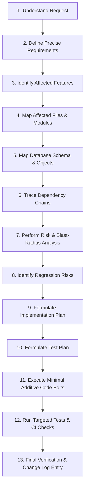

# CHANGE IMPACT ANALYSIS SYSTEM — TRINETRA AI (VAAKRITI)

> **Document Status**: AUTHORITATIVE BASELINE  
> **Source of Truth**: MASTER_PLAN.md (v1.2, Section 18 Overrides)  
> **Mandatory Rule**: Never jump directly from "Add feature X" or "Fix bug Y" to editing files. Follow this impact pipeline before modifying any code.

---

## 1. The 13-Step Change Impact Pipeline

---

## 2. Step-by-Step Execution Guide

### STEP 1: Understand the Request
- Read the user prompt carefully. Determine the exact functional objective.
- Distinguish between **adding new functionality**, **fixing an actual bug**, or **modifying existing behavior**.

### STEP 2: Requirements Definition
- Formulate unambiguous, falsifiable requirements.
- Verify whether the requested behavior conflicts with any principle in `MASTER_PLAN.md` (e.g. Zero In-Call Disconnect, Frozen Compliance Rules, 30-min Admin Timeout).

### STEP 3: Affected Features Audit
- Cross-reference with `docs/architecture/FEATURE_INVENTORY.md`.
- Classify affected features (CORE, IMPORTANT, SECONDARY, OPTIONAL).

### STEP 4: Affected Files Identification
- List every file path that will be modified or created.
- Check if any affected file is in `PROTECTED_COMPONENTS.md` (Level 1, Level 2, Level 3).
- Check if any affected file is listed in `docs/compliance/FROZEN_FILES_MANIFEST.json`. If frozen, STOP: modification is forbidden without written approval.

### STEP 5: Affected Database Objects
- Inspect affected tables, columns, indexes, functions, triggers, and RLS policies.
- **Rule**: If schema changes are required, ensure they are purely **ADDITIVE**. Never drop or rename existing columns. Provide symmetric `up` and `down` SQL scripts.

### STEP 6: Trace Dependency Chains
- Cross-reference with `docs/architecture/DEPENDENCY_MAP.md`.
- Trace upstream triggers and downstream consumers (e.g., modifying `wallets` impacts `agent.py`, dialer, billing UI, and invoice generator).

### STEP 7: Risk & Blast-Radius Analysis
- Evaluate failure scenarios: What happens if this new code times out, throws an unhandled exception, or receives unexpected null inputs?
- Assign a Risk Level (CRITICAL, HIGH, MEDIUM, LOW).

### STEP 8: Regression Risks
- Identify existing working behaviors that could inadvertently break.
- Select relevant tests from `docs/architecture/TESTING_BASELINE.md` (32-point regression list).

### STEP 9: Minimal Implementation Plan
- Formulate an additive design.
- Prefer adding an isolated helper function, new route, or modular service rather than refactoring shared existing code.

### STEP 10: Test Plan Definition
- Define the exact automated unit test, integration test, or manual verification steps required to prove correctness.

### STEP 11: Execute Code Modification
- Implement the change cleanly.
- Respect existing naming conventions, TypeScript strictness, and Python type hints.

### STEP 12: Targeted & Regression Testing
- Run `scripts/verify_frozen_files.py` to ensure compliance hashes remain intact.
- Run `pytest` on affected test suites.
- Run typecheck and linting where applicable.

### STEP 13: Final Verification & Change Log Entry
- Document the modification in `CHANGE_SAFETY_LOG.md`.
- Report actual test outputs and any caveats.
